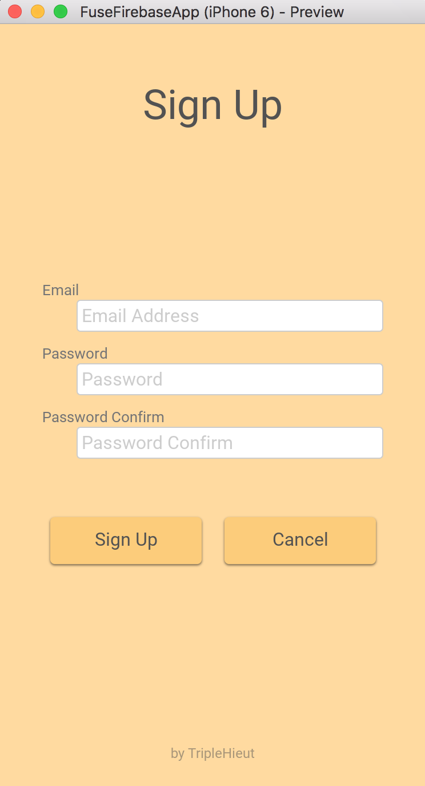

# Fuse + Firebase Example App (Unofficial)


### Fuse + Firebase Example App ?

Firebase Email Auth 를 통해 가입 및 인증을 한 뒤, Firebase Database 를 활용해 사용자 정보를 추가 및 수정 하는 간단한 예제를 담고 있습니다.

Firebase Auth는 웹 방식(Javascript)을 사용하여 구현하였으며, 현재 Firebase Email Auth 만 가입 및 인증이 가능하고 OAuth(Google Auth 나 Facebook Auth)는 구현되지 않았습니다.

(OAuth 구현은 Fuse 홈페이지에 등록된 https://github.com/fuse-compound/Fuse.Firebase 를 참조하시길 바랍니다.)


### Demo 화면

| Sign In                                | Sign Up                                | Main                               |
| -------------------------------------- | -------------------------------------- | ---------------------------------- |
|  |  |  |


### Firebase 설정

1 이 프로젝트를 다운로드 하고 압축을 해제 합니다.

1 https://firebase.google.com/ 접속하여 계정을 생성하고 프로젝트를 생성합니다.

2 Authentication -> 웹설정 (우측상단) 을 눌러  복사하기를 누릅니다.


3 이 프로젝트의 루트 경로(/FuseFirebaseApp)에 firebase-config.js 파일을 생성하고 복사된 내용을 붙여넣고 다음과 같은 형식에 맞춰 파일내용을 수정 후 저장합니다.

```
// firebase-config.js 파일 내용 전체
module.exports = {
    apiKey: "AIzaSyBTuBtqsiCwsZfRoig-d_3ugzJXJPY",
    authDomain: "abcd.firebaseapp.com",
    databaseURL: "https://abcd.firebaseio.com",
    storageBucket: "abcd.appspot.com",
    messagingSenderId: "870251388899"
  };
```

4 이 프로젝트는 이메일 인증을 사용하므로 Firebase Console 해당 프로젝트 에서 Authentication -> 로그인방법 -> 이메일/비밀번호 '중지됨' ->  '사용 설정됨' 으로 변경합니다.


5 Firebase Database 읽기 쓰기 접근 권한 설정을 위해 Firebase Console 해당 프로젝트 에서 Database -> 규칙 탭에서 다음과 같이 접근 권한 설정을 변경합니다.

```
{
  "rules": {
    ".read": "auth != null",
    ".write": "auth != null",  
    "users": {
      "$uid": {
        ".read": "$uid === auth.uid",
        ".write": "$uid === auth.uid"
      }
    }
  }
}
```


6 이 프로젝트는 사용자가 로그인을 하면 Firebase Database 로 부터 서버 메시지를 가져오게 됩니다. Firebase Console 해당 프로젝트 에서 Database -> 데이터 -> + 버튼을 눌러 server_message: "Welcome!" 의 간단한 서버메시지 샘플 키:값을 추가합니다.

7 전체 데이터 베이스 구조는 다음과 같습니다. users 항목은 SignUp시 랜덤 key 값으로 추가됩니다.


